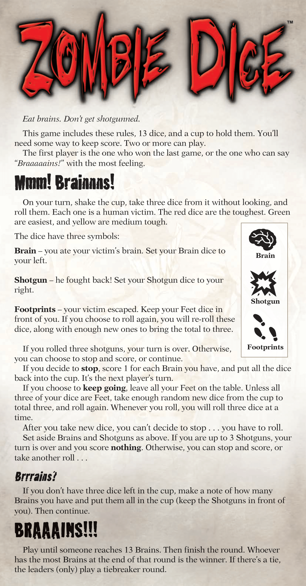
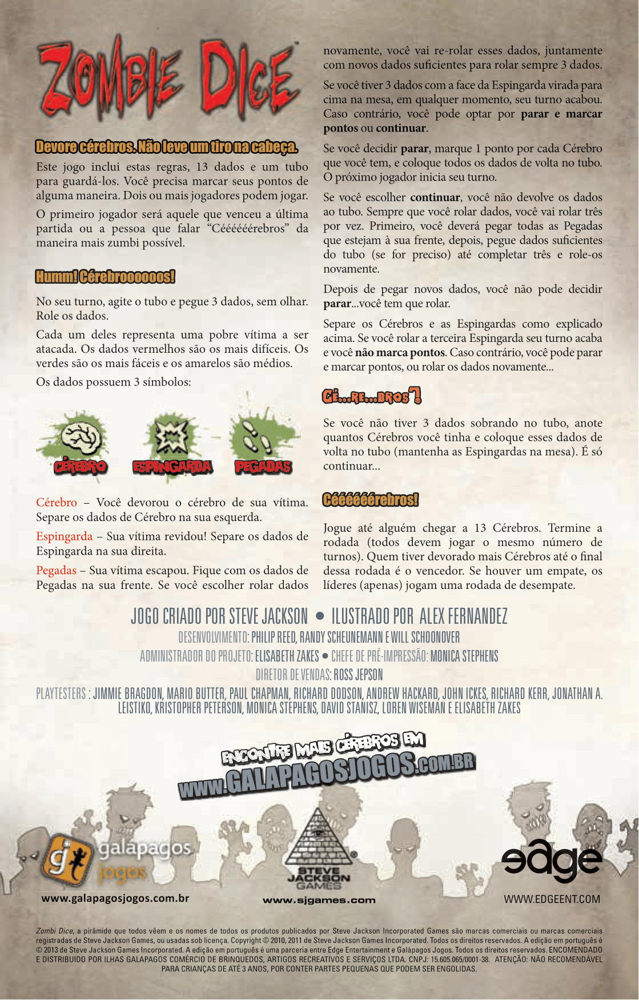

<br />
<p align="center">
  <h3 align="center">Zombie Dice</h3>

  <p align="center">
    Zombie Dice is a "press your luck" party dice game created by Steve Jackson Games and released in 2010.
	The gameplay is simple, follow the instructions on the about section to play.
    <br />
	  <br />
    <a href="https://github.com/xandao6/zombie-dice"><strong>Explore the docs »</strong></a>
    <br />
    <a href="https://github.com/xandao6/zombie-dice/issue">Report Bug</a>
    ·
    <a href="https://github.com/xandao6/zombie-dice/issues">Request Feature</a>
  </p>
</p>


<!-- TABLE OF CONTENTS -->
<details open="open">
  <summary>Table of Contents</summary>
  <ol>
    <li>
      <a href="#about-the-project">About The Project</a>
      <ul>
        <li><a href="#features">Features</a></li>
        <li><a href="#built-with">Built With</a></li>
      </ul>
    </li>
    <li><a href="#usage">Usage</a></li>
    <li><a href="#roadmap">Roadmap</a></li>
    <li><a href="#contributing">Contributing</a></li>
    <li><a href="#license">License</a></li>
    <li><a href="#contact">Contact</a></li>
  </ol>
</details>


<!-- ABOUT THE PROJECT -->
## About The Project

<div align="center">
  <a href="https://github.com/xandao6/zombie-dice">
    
	
  </a>
</div>

### Features

* Strictly follow the rules of the game, respecting all probabilities
* Terminal-based game
* Has input validation in all interactions
* Accept from 2 to 99 players
* Players names can have a min of 3 chars and max of 13 chars, empty name will generate a generic name

### Built With

* [Python3](https://www.python.org/) - A general-purpose, high-level programming language
* [random](https://docs.python.org/3/library/random.html) - A library for generating pseudo-random numbers
* [typing](https://docs.python.org/3/library/typing.html) - A library for type hints

<!-- USAGE EXAMPLES -->
## Usage

* Run the game

	```sh
  python3 main.py
  ```

<!-- ROADMAP -->
## Roadmap

See the [open issues](https://github.com/xandao6/zombie-dice/issues) for a list of proposed features (and known issues).


<!-- CONTRIBUTING -->
## Contributing

Contributions are what make the open source community such an amazing place to be learn, inspire, and create. Any contributions you make are **greatly appreciated**.

1. Fork the Project
2. Create your Feature Branch (`git checkout -b feature/AmazingFeature`)
3. Commit your Changes (`git commit -m 'Add some AmazingFeature'`)
4. Push to the Branch (`git push origin feature/AmazingFeature`)
5. Open a Pull Request

<!-- LICENSE -->
## License

Distributed under the MIT License. See [LICENSE](./LICENSE.md) for more information.

Free software =)


<!-- CONTACT -->
## Contact

Alexandre Calil - [@xandao6](https://www.linkedin.com/in/xandao6/) - alexandrecalilmf@gmail.com

Project Link: [https://github.com/xandao6/zombie-dice](https://github.com/xandao6/zombie-dice)


<!-- LINKS & IMAGES Variables-->
<!-- https://www.markdownguide.org/basic-syntax/#reference-style-links -->
[contributors-shield]: https://img.shields.io/github/contributors/xandao6/repo.svg?style=for-the-badge
[contributors-url]: https://github.com/xandao6/repo/graphs/contributors
[forks-shield]: https://img.shields.io/github/forks/xandao6/repo.svg?style=for-the-badge
[forks-url]: https://github.com/xandao6/repo/network/members
[stars-shield]: https://img.shields.io/github/stars/xandao6/repo.svg?style=for-the-badge
[stars-url]: https://github.com/xandao6/repo/stargazers
[issues-shield]: https://img.shields.io/github/issues/xandao6/repo.svg?style=for-the-badge
[issues-url]: https://github.com/xandao6/repo/issues
[license-shield]: https://img.shields.io/github/license/xandao6/repo.svg?style=for-the-badge
[license-url]: https://github.com/xandao6/repo/blob/master/LICENSE.txt
[linkedin-shield]: https://img.shields.io/badge/-LinkedIn-black.svg?style=for-the-badge&logo=linkedin&colorB=555
[linkedin-url]: https://linkedin.com/in/xandao6
